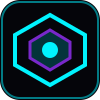

# 🛸 Futuristic 3D Creative Developer & Engineering Portfolio

An Awwwards-grade, highly realistic, production-ready 3D personal portfolio website built with React, TypeScript, Three.js, React Three Fiber (R3F), Drei, Framer Motion, and Tailwind CSS.



## 🌟 Key Features

- **3D Floating Digital Core**: Physically based material shaders, responsive cursor Lerp tracking, camera tilt, and interactive particle field.
- **Synthesized Audio Engine**: Built-in Web Audio API synthesizer for sleek sci-fi micro-interactions (zero external audio files, zero latency).
- **Cinematic Case Study Experience**: Fullscreen 7-phase mini-product presentations (**Problem → Research → Idea → Architecture → Implementation → Innovation → Results**).
- **Interactive Skills System Network**: 8 technical domain categories (Frontend, Backend, AI/ML, 3D/Creative, Cloud, Databases, Programming, Tools) with proficiency indicators and skill node inspection drawer.
- **Innovation Lab**: Interactive live R&D canvas sandboxes (Quantum Field Shader Matrix with real-time cursor physics controls).
- **Dynamic 3D Quality & Fallback Controller**: Auto-detects device capabilities and supports `High`, `Performance`, or `Off` (2D canvas matrix fallback) modes, alongside `prefers-reduced-motion` compliance.
- **Centralized Data Architecture**: All personal details, bio, skills, experience, projects, case studies, innovations, achievements, and socials are centralized in `src/data/portfolioData.ts` with clean placeholders for instant customization.

---

## 🛠️ Technology Stack

- **Core**: React 18, TypeScript, Vite
- **3D / Real-Time Graphics**: Three.js, React Three Fiber (`@react-three/fiber`), Drei (`@react-three/drei`)
- **Animation & FX**: Framer Motion, Web Audio API
- **Styling & UI**: Tailwind CSS, Lucide React Icons
- **Typography**: Google Fonts (Space Grotesk, Inter, JetBrains Mono)

---

## 📁 Project Architecture

```
portfolio/
├── public/
│   ├── favicon.svg             # Futuristic 3D core icon
│   └── og-image.png            # Open Graph banner
├── src/
│   ├── components/
│   │   ├── 3d/
│   │   │   ├── DigitalCore.tsx # R3F Icosahedron & orbital ring scene
│   │   │   └── CanvasContainer.tsx # WebGL wrapper + 2D Matrix fallback
│   │   └── ui/
│   │       ├── Navbar.tsx      # Glassmorphic header with sound & 3D toggles
│   │       ├── CustomCursor.tsx # Magnetic pointer ring
│   │       ├── SectionHeader.tsx # Standardized section headings
│   │       └── CaseStudyModal.tsx # Fullscreen mini product presentation
│   ├── sections/
│   │   ├── HeroSection.tsx     # Headline, CTAs & availability status
│   │   ├── AboutSection.tsx    # Storytelling bio & philosophy pillars
│   │   ├── SkillsSection.tsx   # Interactive node graph & search filter
│   │   ├── ExperienceSection.tsx # Career timeline & architectural impact
│   │   ├── ProjectsSection.tsx # Showcase cards & case study triggers
│   │   ├── InnovationLabSection.tsx # Live interactive canvas sandbox
│   │   ├── AchievementsSection.tsx # Honors, certifications & academics
│   │   └── ContactSection.tsx  # Futuristic CTA, form & email copy
│   ├── data/
│   │   └── portfolioData.ts    # Centralized placeholder configuration
│   ├── hooks/
│   │   ├── useAudioEffects.ts  # Audio synthesizer controller hook
│   │   └── use3DQuality.ts     # FPS & hardware capability detector
│   ├── utils/
│   │   └── audio.ts            # Web Audio API sound synthesizer
│   ├── styles/
│   │   └── index.css           # Custom dark theme, neon tokens, scrollbar
│   ├── App.tsx                 # Root application wrapper
│   └── main.tsx                # Entry point
├── index.html                  # Full SEO & OpenGraph meta tags
├── package.json                # Dependencies & build scripts
├── vite.config.ts              # Vite configuration with path aliases
├── tailwind.config.js          # Custom colors, fonts, and keyframes
├── tsconfig.json               # TypeScript configuration
└── README.md                   # Setup & deployment documentation
```

---

## ⚡ Quick Start & Development

### 1. Install Dependencies

```bash
npm install
```

### 2. Run Local Development Server

```bash
npm run dev
```

The application will be accessible at `http://localhost:3000`.

---

## ✏️ Customizing Your Personal Information

All personal portfolio information is located in a single central file:

**`src/data/portfolioData.ts`**

Simply open `src/data/portfolioData.ts` and update the placeholders:

1. **`profile`**:
   - `name`: Your full name
   - `title`: Professional title (e.g. `Software Engineer | AI & Creative Developer`)
   - `tagline`: Headline tagline
   - `email`: Your email address
   - `socials`: GitHub, LinkedIn, Resume, Portfolio URLs
   - `aboutBio`: Paragraph array describing your engineering background

2. **`skills`**: Update technical categories and proficiency levels.
3. **`projects`**: Add your custom project descriptions, problem/solution highlights, and case study tabs.
4. **`experiences`**: Add your career history, responsibilities, and achievements.
5. **`experiments`**: Add lab ideas and prototypes.
6. **`achievements`**: Add awards, certifications, and academic degrees.

---

## 🚀 Building & Production Deployment

### Build for Production

To create an optimized production bundle:

```bash
npm run build
```

This will run TypeScript checks and compile static production files to the `dist/` directory.

### Preview Production Build

```bash
npm run preview
```

### Deployment Options

- **Vercel**: Push your repository to GitHub, connect to Vercel, and deploy with default Vite settings.
- **Netlify**: Connect your GitHub repository and set build command to `npm run build` and publish directory to `dist`.
- **GitHub Pages**: Build the project and deploy the static `dist` directory using `gh-pages`.

---

## 🔒 License

MIT License. Feel free to use this template for your personal portfolio.
